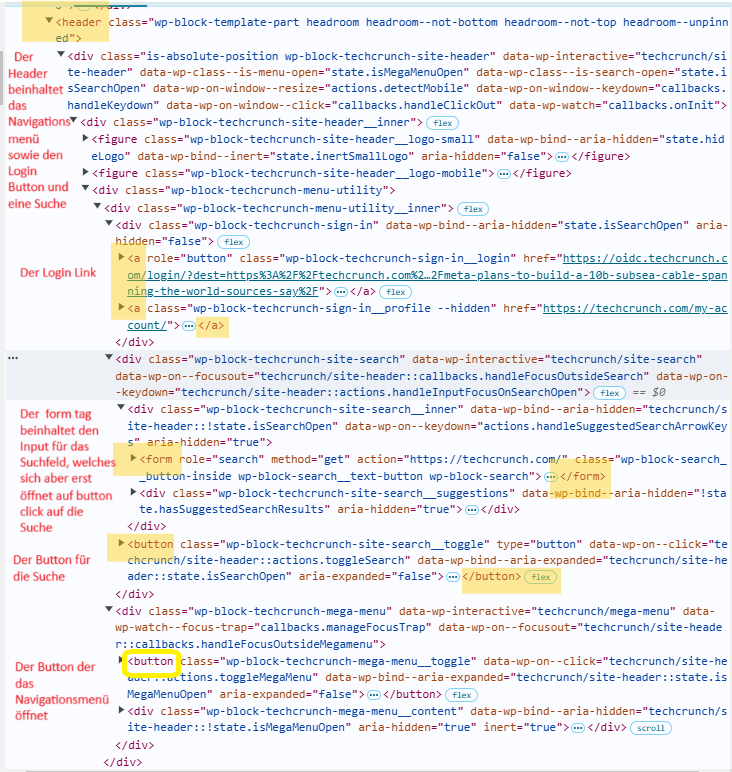
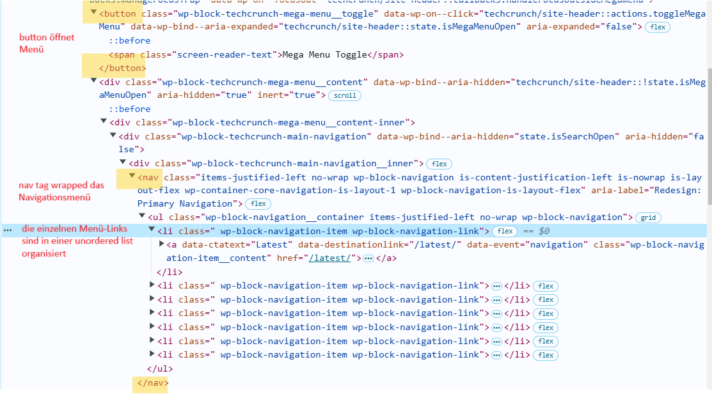
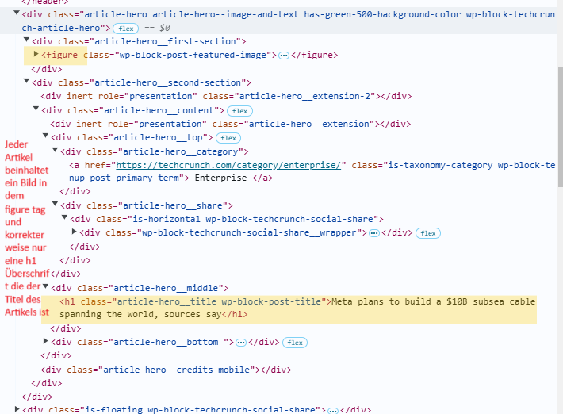
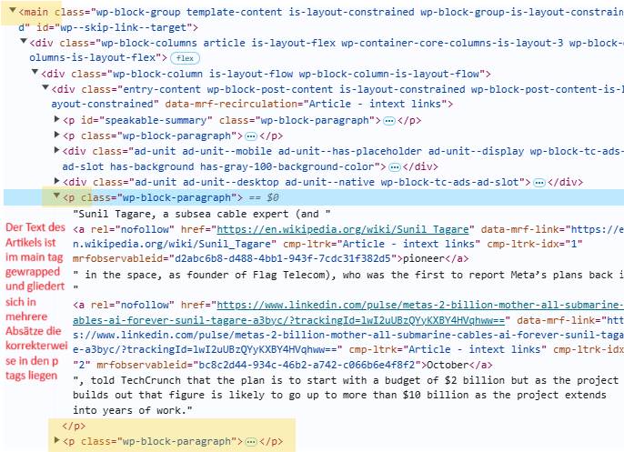
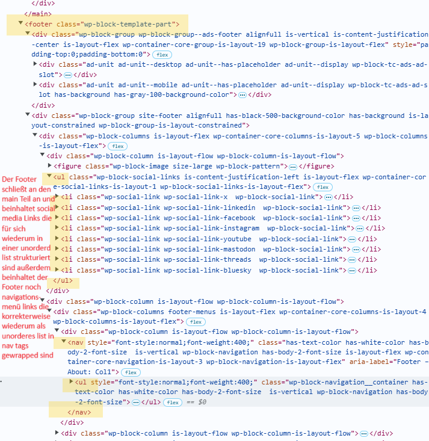

Was macht deine Lieblingswebseite?
Meine Beispielseite: techcruch.com
Am Beispiel eines Artikels auf techcrunch

Aufbau des Headers

Aufbau des Navigationsmenüs

Aufbau der Artikeleinleitung

Aufbau des Hauptteils 

Aufbau des Footers 

Es lässt sich feststellen dass die Webseite techchrunch.com semantsches Html gezielt einsetzt um die Artikel wie auch das Navigationsmenü und Header zu strukturieren und sich zudem auch an die entsprechenden Regeln hält wie zum Beispiel dass das h1 element nur einmal pro Artikel eingesetzt wird und das das Navigationsmenü in die nav tags gewrapped wird sowie der Hauptteil des Artikels mit den main tag gekennzeichnet wird und die Abschliessende Sektion mit dem footer tag kenntlich gemacht wird.